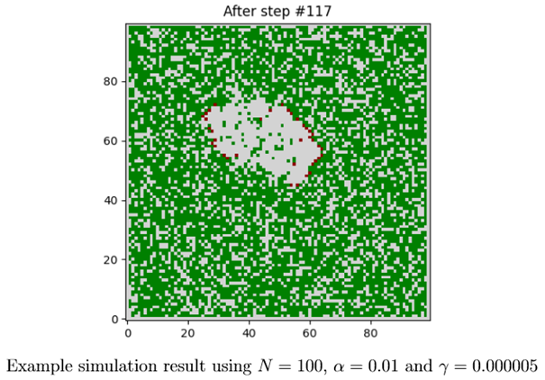

# Wildfire
## [Cellular automaton to perform a simple wildfire simulation in C](https://en.wikipedia.org/wiki/Forest-fire_model)

In this assigment we are going to implement a cellular automaton to perform a simple wild-
fire simulation. A cellular automaton is a (relatively) simple approach to model and simulate
dynamical systems. It consists of a playing field composed of cells, each of which is in one of
a discrete set of states. Additionally there are rules describing how the state of a cell changes
from one time-step to the next depending on its state and usually also that of its neighbours.

### Field and States

In our wildfire simulation we are going to use a 2D playing field with N × N cells representing
our forest. Each cell is in one of the following three states:  
- TREE: the cell has a tree in it
- FIRE: the tree in this cell is burning
- ASHES: the fire has reduced the tree to ashes and died

### Initial and Boundary Conditions

We start our simulation by setting all cell states to ASHES and use so called closed boundary
conditions. The latter is to say that all cells along the boundary of the playing field never
change their state.

### Update rules

Going from one time-step to the next one means sweeping over all cells of our forest and
computing their new states from the previous ones using the following set of update rules,
where cij is the state of the cell at position (i, j)
a. If cell corresponds to ASHES, then with a probability α a tree will grow in that cell, so
that the new cell becomes TREE. If nothing grows, the cell state remains unchanged.
b. If cell corresponds to TREE, then we need to check the four nearest neighbour cells. If at
least one of these has a state of FIRE, the tree in cell (i, j) will also catch fire and we set
cell new to FIRE. If this is not the case, then with a probability γ lightning will strike the
tree, in which case we also set cell new to FIRE. Otherwise the state will remain TREE.
c. Finally, if the old state of cell (i, j) is FIRE, then the latter will die and the new state
becomes ASHES.

  

### Tasks

- After updating your sandbox you will find a new sub-directory 02 Archive/Wildfire. It contains two files: wildfire.c and wildfire.py. The former is an incomplete implementation of our cellular automaton, while the latter is a Python script for visualising the simulation results.
- Your primary task is to complete the implementation of wildfire.c. The places where code is missing are marked by /* YOUR CODE HERE */ comments.
- Inside the code we are using two playing fields, one to hold the current state of our forest, and an auxilliary one for performing the update step. Once we have computed the new states for all cells by calling updateForest(), we need to somehow transfer these cell states from the aux variable into the forest variable. Try to come up with an efficient way for doing this.
- Hint: To test your implementation run a simulation with γ = 0, what should happen?
- Perform some simulations, e.g. by chosing α from {0.01, 0.02, 0.1, 0.2} and γ from {5 · 10−6, 5 · 10−5, 1 · 10−4, 5 · 10−3}. Are there observable differences? Does the size N of the playing field have a significant influenc
